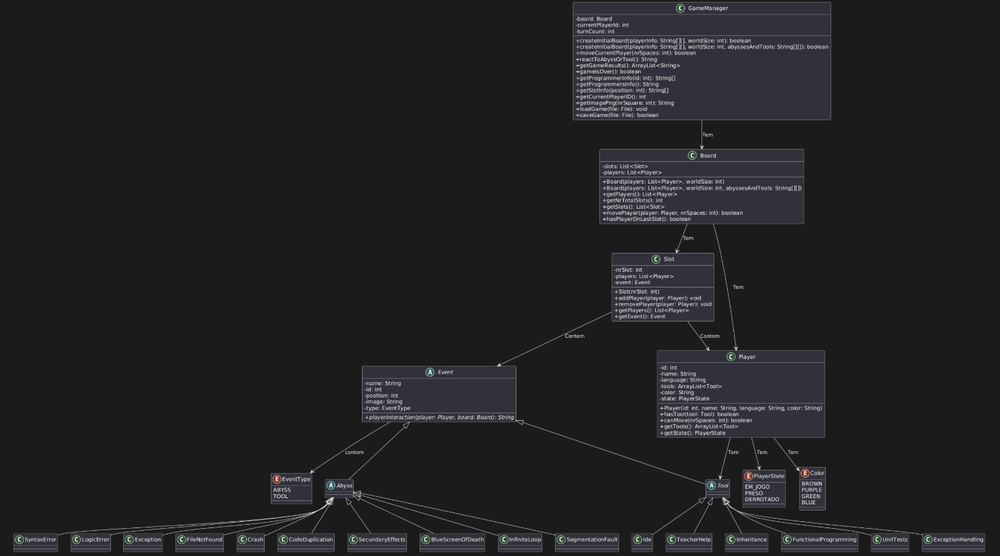

#  The Great Programming Journey

Um pequeno jogo desenvolvido em **Java**, onde múltiplos programadores competem numa jornada até à glória final!  
O projeto faz uso de conceitos fundamentais de **POO (Programação Orientada a Objetos)**, incluindo **classes**, **enumerações**, **listas**, e **gestão de estado de jogo**.

---

##  Estrutura do Projeto

Contém as seguintes classes principais:

| Classe | Descrição |
|--------|------------|
| **GameManager** | Classe principal que gere o jogo — jogadores, turnos, tabuleiro e resultados. |
| **Board** | Representa o tabuleiro de jogo (lista de slots). |
| **Slot** | Cada posição do tabuleiro, podendo conter um ou mais jogadores. |
| **Player** | Representa um jogador com `id`, `nome`, `linguagem` e `cor`. |
| **Color (enum)** | Enumeração com as cores possíveis dos jogadores (`BROWN`, `PURPLE`, `GREEN`, `BLUE`). |

##  Diagrama UML

O diagrama UML abaixo representa a estrutura e relações entre as classes:

---

##  Autoria

Projeto desenvolvido por **Duarte Martins (a22400561)**  
no âmbito da unidade curricular *Linguagens de Programação 2* – **Universidade Lusófona**
